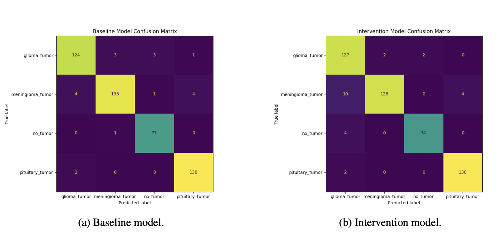
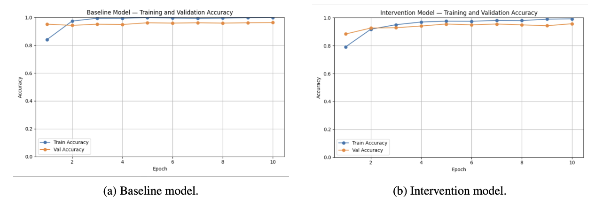
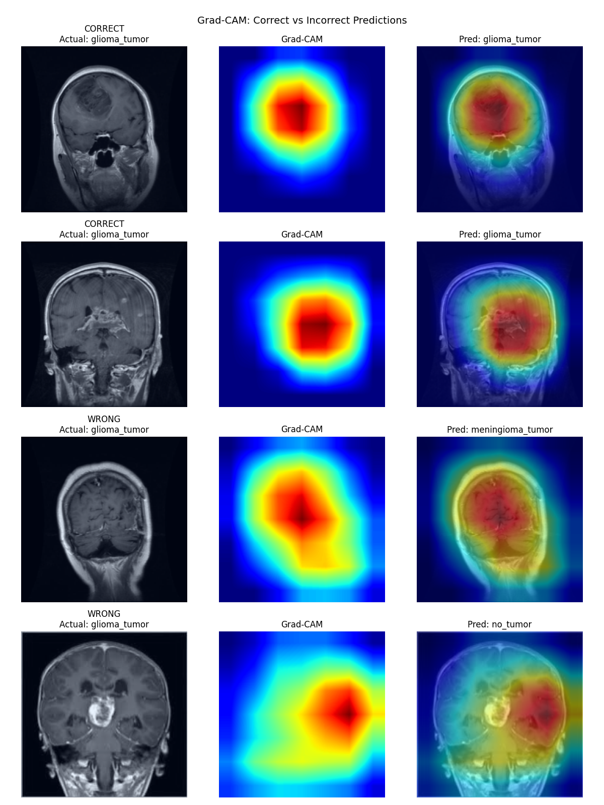
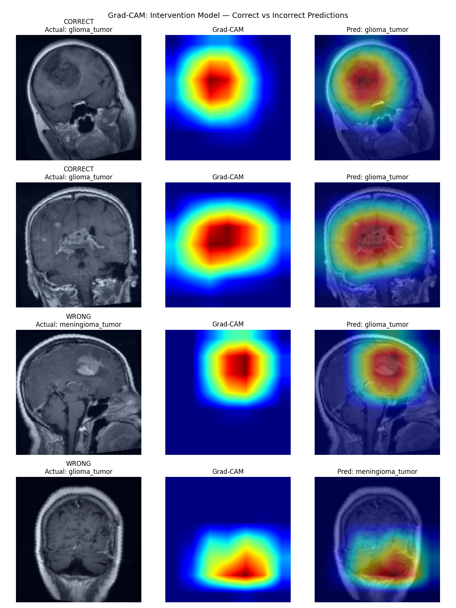

# Brain MRI Tumor Classification: Detecting and Mitigating Shortcut Learning

A deep learning pipeline that trains, evaluates, and explains a ResNet-18 brain tumor classifier, then uses Grad-CAM to demonstrate that the model relied on a spurious shortcut and engineers a preprocessing intervention to mitigate it.

**Tech:** Python, PyTorch, torchvision, scikit-learn, OpenCV, Grad-CAM, ResNet-18 (transfer learning)

## Overview

CNN-based brain MRI classifiers often achieve high accuracy without learning clinically meaningful features, a problem known as shortcut learning, where the model bases predictions on misleading patterns such as scanner noise, image borders, or acquisition artifacts. This project investigates whether a ResNet-18 tumor classifier focuses on relevant brain anatomy or exploits non-biological artifacts, using Grad-CAM to visualize model attention and a preprocessing intervention to test whether the shortcut can be disrupted.

The baseline model reached 96.1% accuracy but, as Grad-CAM revealed, did so by keying on tumor location relative to the skull rather than tumor morphology. The intervention disrupted this shortcut and shifted model attention toward clinically relevant regions, trading 2.6% accuracy for a more trustworthy model. The project demonstrates that high accuracy does not guarantee a correct model, and that interpretability can surface failures that aggregate metrics hide.

## What I Built

| Component | Description |
|-----------|-------------|
| **Training pipeline** | ImageFolder data loading, 70/15/15 split, ResNet-18 fine-tuning with Adam and Cross-Entropy loss, per-epoch accuracy tracking |
| **Evaluation** | Macro-averaged accuracy, precision, and recall on a held-out test set |
| **Explainability** | Grad-CAM implementation using forward and backward hooks on the final conv block to generate attention heatmaps |
| **Intervention** | Custom transform pipeline (center crop plus augmentation) designed to remove the spurious signal |

## Results

| Metric    | Baseline | Intervention |
|-----------|----------|--------------|
| Accuracy  | 0.961    | 0.935        |
| Precision | 0.960    | 0.938        |
| Recall    | 0.964    | 0.936        |

The accuracy drop is the central finding rather than a regression. It shows the baseline score was partly inflated by a spurious correlation, while the intervention model is less accurate but more clinically defensible.

<!-- IMAGE: Confusion matrices, baseline and intervention side by side. Save as assets/confusion_matrices.png -->

*Primary error in both models is glioma-meningioma confusion. Meningiomas naturally sit near the skull, which the baseline learned as a proxy for class identity.*

<!-- IMAGE: Training and validation accuracy over 10 epochs. Save as assets/training_curves.png -->


## How It Works

**1. The shortcut (baseline)**

Grad-CAM showed that correct predictions attended to internal brain tissue, while misclassifications concentrated on the skull boundary, indicating the model used location rather than pathology.

<!-- IMAGE: Baseline Grad-CAM gallery. Save as assets/gradcam_baseline.png -->


**2. The fix (intervention)**

Adding CenterCrop(180) removes the skull boundary from the frame, while RandomHorizontalFlip, RandomRotation(15 degrees), and ColorJitter break location dependence. Misclassified attention shifted toward interior brain regions.

<!-- IMAGE: Intervention Grad-CAM gallery. Save as assets/gradcam_intervention.png -->


## Tech Stack and Design Choices

- **ResNet-18 with ImageNet transfer learning** for fast convergence and training stability on a small dataset, with the final FC layer swapped for the target class count.
- **Grad-CAM via hooks** registered on layer4[1].conv2 to capture activations and gradients without modifying the model.
- **Adam (lr=1e-4), 10 epochs, batch size 32**, trained on a single T4 GPU (Colab).
- **Dataset:** Sartaj Brain Tumor MRI (glioma, meningioma, pituitary, no tumor).

## Repository Structure

```
.
├── data/                       # ImageFolder dataset (one subfolder per class)
├── assets/                     # README images
├── train_baseline.py           # Baseline ResNet-18 -> baseline_resnet18.pth
├── train_intervention.py       # Intervention model -> intervention_resnet18.pth
├── evaluate.py                 # Accuracy, precision, recall on test split
├── gradcam.py                  # Grad-CAM heatmap for a single image
└── README.md
```

## Quickstart

```bash
pip install torch torchvision scikit-learn opencv-python pillow matplotlib numpy

python train_baseline.py        # trains and saves baseline_resnet18.pth
python train_intervention.py    # trains and saves intervention_resnet18.pth
python evaluate.py              # prints accuracy, precision, recall
python gradcam.py               # set img_path; saves gradcam_output.png
```

## Next Steps

- Isolate the exact non-medical features driving predictions.
- Add segmentation to mask everything but brain and tumor tissue.
- Validate against radiologist-annotated attention to replace Grad-CAM's post-hoc approximation.
- Test additional architectures and a larger, multi-source dataset.

## Context

Course research project at the Paul G. Allen School of Computer Science and Engineering, University of Washington.
Team: Prathiyanka Arun, Ella Cao, Dhruti Vadlamudi.

<details>
<summary>References</summary>

- Brown, A., et al. (2023). Detecting shortcut learning for fair medical AI using shortcut testing. *Nature Communications*, 14, 4314.
- Hill, B. G., et al. (2024). The risk of shortcutting in deep learning algorithms for medical imaging research. *Scientific Reports*, 14, 29224.
- Ong Ly, C., et al. (2024). Shortcut learning in medical AI hinders generalization. *npj Digital Medicine*, 7, 124.

</details>
